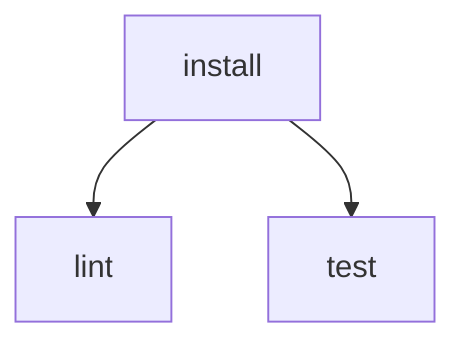

# Command Reference

Talos commands use `talos <command> [flags]`.

Use command help when you want the exact flags supported by your installed version:

```bash
talos -h
talos run -h
```

Commands reject unexpected positional arguments. For example, use `talos run --file workflow.yaml`, not `talos run workflow.yaml`.

## `talos init`

Create a starter workflow file.

```bash
talos init
```

Write to a custom path:

```bash
talos init --file ./workflows/dev.yaml
```

Overwrite an existing file:

```bash
talos init --force
```

Flags:

| Flag | Default | Description |
| --- | --- | --- |
| `--file` | `talos.yaml` | Path to write the starter workflow. |
| `--force` | `false` | Overwrite an existing workflow file. |

## `talos run`

Run a workflow.

```bash
talos run
```

Run a custom workflow file:

```bash
talos run --file ./workflows/dev.yaml
```

Preview the execution plan without running commands:

```bash
talos run --dry-run
```

Run one task and the dependencies needed for it:

```bash
talos run --target build
```

Limit the number of tasks running at the same time:

```bash
talos run --max-concurrency 2
```

Use `0` for unlimited concurrency, which is the default. Negative values are rejected.

When concurrency is limited, Talos starts ready tasks in task-name order. With unlimited concurrency, independent tasks still run in parallel, so their live output can interleave.

Suppress live task output while keeping the final summary:

```bash
talos run --quiet
```

Print task execution context before each task runs:

```bash
talos run --verbose
```

Print only the final summary as JSON:

```bash
talos run --summary json
```

`--quiet` and `--verbose` cannot be used together. `--summary json` cannot be used with `--verbose` because JSON mode writes only machine-readable summary output.

Shell selection is configured in the workflow file with `defaults.shell` or task-level `shell`, not with a run flag. See [Workflow Configuration](workflows.md#shell).

Flags:

| Flag | Default | Description |
| --- | --- | --- |
| `--file` | `talos.yaml` | Path to the workflow file. |
| `--dry-run` | `false` | Print the execution plan without running commands. |
| `--target` | empty | Run only the specified task and its dependencies. |
| `--max-concurrency` | `0` | Maximum number of concurrent tasks. `0` means unlimited. |
| `--quiet` | `false` | Suppress live task output and print only the final summary. |
| `--verbose` | `false` | Print task execution context before each task runs. |
| `--summary` | `human` | Summary output format: `human` or `json`. |

## `talos validate`

Validate a workflow without running commands.

```bash
talos validate
```

Validate a custom workflow file:

```bash
talos validate --file ./workflows/dev.yaml
```

Validation checks YAML parsing, duplicate mapping keys, required task commands, task configuration, missing dependencies, duplicate dependencies, and dependency cycles.

Flags:

| Flag | Default | Description |
| --- | --- | --- |
| `--file` | `talos.yaml` | Path to the workflow file. |

## `talos visualize`

Print the workflow graph as Mermaid.

```bash
talos visualize
```

Render a custom workflow file:

```bash
talos visualize --file ./workflows/dev.yaml
```

Example output:



Flags:

| Flag | Default | Description |
| --- | --- | --- |
| `--file` | `talos.yaml` | Path to the workflow file. |

## `talos version`

Print version and build metadata.

```bash
talos version
```

The release build includes the version tag, commit, and build timestamp.
