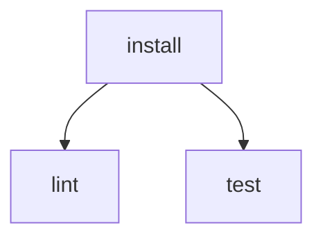

# Command Reference

Talos commands use `talos <command> [flags]`.

Use command help when you want the exact flags supported by your installed version:

```bash
talos -h
talos run -h
```

## `talos init`

Create a starter workflow file.

```bash
talos init
```

Write to a custom path:

```bash
talos init --file ./workflows/dev.yaml
```

Overwrite an existing file:

```bash
talos init --force
```

## `talos run`

Run a workflow.

```bash
talos run
```

Run a custom workflow file:

```bash
talos run --file ./workflows/dev.yaml
```

Preview the execution plan without running commands:

```bash
talos run --dry-run
```

Run one task and the dependencies needed for it:

```bash
talos run --target build
```

Limit the number of tasks running at the same time:

```bash
talos run --max-concurrency 2
```

Shell selection is configured in the workflow file with `defaults.shell` or task-level `shell`, not with a run flag. See [Workflow Configuration](workflows.md#shell).

## `talos validate`

Validate a workflow without running commands.

```bash
talos validate
```

Validate a custom workflow file:

```bash
talos validate --file ./workflows/dev.yaml
```

Validation checks YAML parsing, required task commands, task configuration, missing dependencies, and dependency cycles.

## `talos visualize`

Print the workflow graph as Mermaid.

```bash
talos visualize
```

Render a custom workflow file:

```bash
talos visualize --file ./workflows/dev.yaml
```

Example output:



## `talos version`

Print version and build metadata.

```bash
talos version
```

The release build includes the version tag, commit, and build timestamp.
